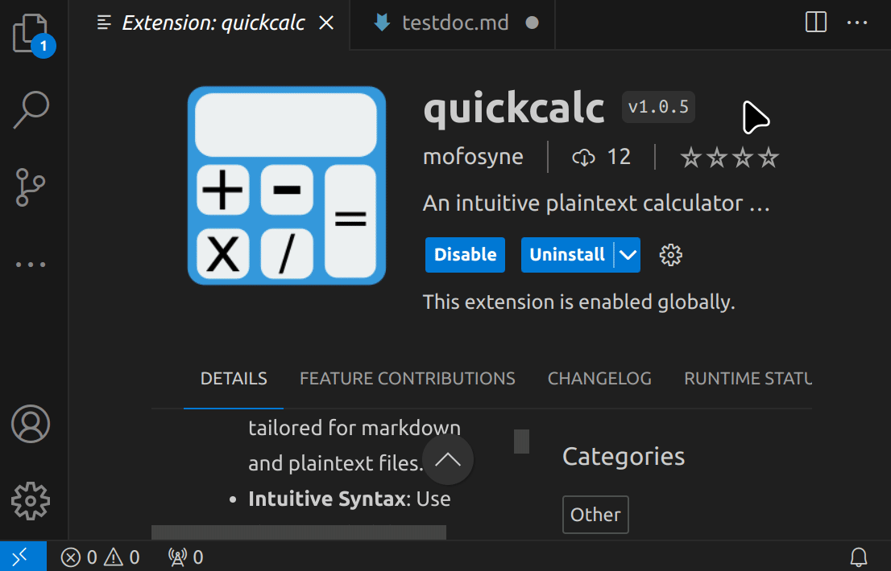

# QuickCalc for VS Code


A seamless integration of the [QuickMathJS - NPM](https://www.npmjs.com/package/quickmathjs?activeTab=readme) calculator into VS Code, allowing you to perform mathematical calculations directly within your editor. Perfect for those working with markdown or plaintext files and want real-time calculations without leaving the VS Code environment. The syntax of this calculator is intended to emulate the style of plaintext maths sent over email (much like how markdown/commonmark is intended to match the natural email writing style of people)



## Features

- **Inline Calculations**: Perform calculations directly within your files.
- **Markdown & Plaintext Support**: Specifically tailored for markdown and plaintext files.
- **Intuitive Syntax**: Use the ```math delimiter in markdown files to define sections for calculations.
- **Real-time Results**: Instantly see the result of your calculations.

## How to Use

1. Open a markdown or plaintext file in VS Code.
2. Type out your calculations. For markdown files, wrap your calculations with the ```math delimiter.
    - If missing, then the entire document is assumed to be a calculation sheet. This is okay in a pitch, but may cause some issues if '=' or ':' is misrecognised.
3. Execute the `QuickCalc` command (default shortcut: `Ctrl+Shift+Q`).
4. See the results inline within your file!

**Example**:

    # Markdown Document
    example content

    ```math
    a = 5
    b = 7
    c = a + b = ?
    = ?
    1 + 1
        = ?
        c = ?
    total = a + b + c
    total:
    ```

After running the command, this becomes:

    # Markdown Document
    example content

    ```math
    a = 5
    b = 7
    c = a + b = 12
    = 12
    1 + 1
        = 2
        c = 12
    total = a + b + c
    total: 24
    ```

https://github.com/mofosyne/QuickMathJS

## Requirements

- VS Code version 1.50 or newer.
- No external dependencies!

## Extension Settings

QuickCalc is designed for seamless use. However, there are a few settings for customization:

- `quickcalc.autoEvaluateOnSave`: Automatically evaluate math expressions in Markdown files on save when wrapped in \`\`\`math blocks. Defaults to `true`.

## Known Issues

- Only supports markdown and plaintext files for now. We're looking to expand to other formats soon.
- Complex calculations might require wrapping in the ```math delimiter even in plaintext files for accurate results.

## Release Notes

### 1.0.0

- Initial release of QuickCalc for VS Code.
- Supports inline calculations for markdown and plaintext files.

## Contribute

Got suggestions or found a bug? [Open an issue](https://github.com/mofosyne/vscode-quickcalc/issues) on our GitHub repository. Contributions via pull requests are very welcome!

## Acknowledgements

- Math.js: For the core mathematical functions.

## License

This extension is licensed under the [GNU General Public License v3.0](https://github.com/mofosyne/vscode-quickcalc/blob/main/LICENSE).

---

## For More Information

- [Original QuickMathJS Repository](https://github.com/mofosyne/QuickMathJS)
- [VS Code's Extension Development Documentation](https://code.visualstudio.com/api)

**Enjoy your calculations within VS Code!**
